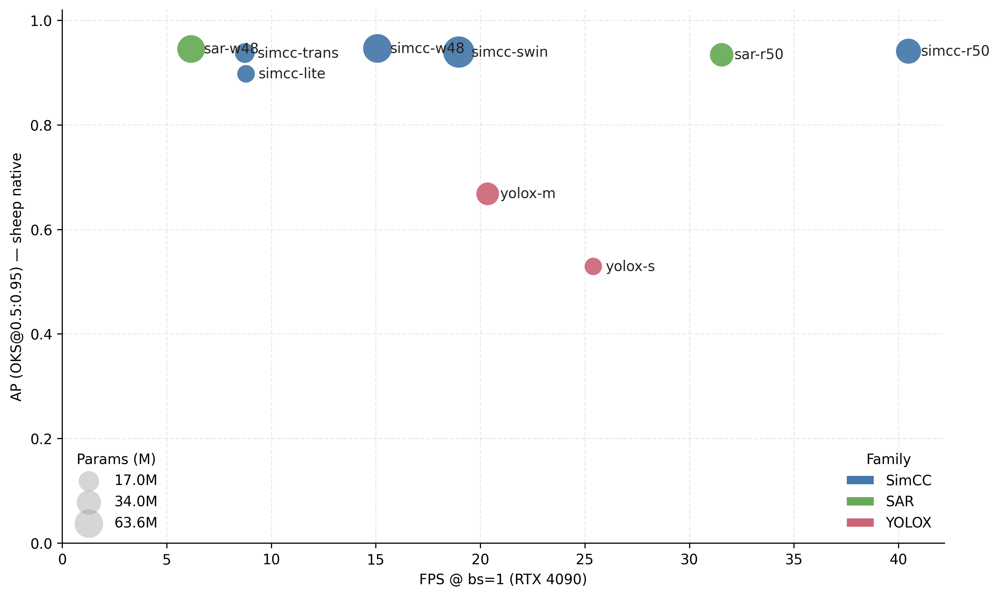

# Performance Evaluation of a State-of-the-Art Keypoint Detection Method for Precision Livestock Farming

This repository provides a **reproducible benchmark and dataset for livestock keypoint detection and pose estimation** in precision livestock farming. We release a high-resolution, multi-species dataset with **2,229 RGB images of cattle, horses, and sheep**, covering diverse breeds, postures, and environments. Each animal instance is annotated with **18 anatomical keypoints** plus **visibility/occlusion labels**, enabling fine-grained analysis of posture and behaviour.

On top of this dataset, we implement a unified benchmark that evaluates three representative state-of-the-art frameworks — **SimCC, SAR, and YOLOX-Pose** — combined with modern backbones including **ResNet-50, HRNet-W48, HRFormer, LiteHRNet, and Swin** under a standardised training setup. We systematically compare **accuracy, robustness, and deployability** across:

- in-domain and cross-domain settings, including region-wise and visibility-aware analyses;
- different hardware platforms (**RTX 4090, Jetson AGX Orin, CPU**) in terms of latency/FPS, memory usage, and model size;
- zero-/few-shot transfer to external datasets (e.g. AP-10K sheep) under limited annotation budgets.

Overall, this project releases the **dataset, training and evaluation code, and analysis scripts** to support fair comparison, practical model selection, and further development of livestock pose estimation methods.
lection, and future development of livestock pose estimation methods.



## Environment Setup

### To install the required dependencies, use the following commands:

#### 1. Clone code
```
git clone https://github.com/yww0411/Livestock-keypoint-detection
cd Livestock-keypoint-detection
```
#### 2. Install PyTorch following official instruction（cuda version 11.8）
```
conda create -n keypoint python=3.8
conda activate keypoint
pip install torch==2.0.0 torchvision==0.15.1 torchaudio==2.0.1 --index-url https://download.pytorch.org/whl/cu118a
pip install xtcocotools>=1.12 xdoctest>=0.10.0
pip install pytest pytest-runner 
```
#### 3. Install other dependency python packages

* SimCC
```
pip install chumpy json_tricks munkres 
pip install interrogate isort==4.3.21 parameterized yapf
pip install opencv-python coverage flake8  
```
* SAR
```
pip install -U openmim
mim install mmengine
mim install "mmcv==2.0.1"
mim install "mmpose==1.3.1"
```
* YOLOX-Pose
```
pip install mmyolo==0.5.0
pip install mmdet==3.0.0rc6
```
#### 4. Prepare your dataset

Download [our dataset]() or reorganize your own dataset according to the structure below and
place the dataset in the directory of the model you intend to use.
(xxx.json) is a COCO-format keypoint annotation file containing keypoint annotations for each corresponding image folder.
```
./data_process
|── cattle/horse/sheep     
|       └── annotations
|       |      └──test_annotations.coco.json
|       |      └──train_annotations.coco.json
|       |      └──val_annotations.coco.json
|       └── images
|       |      └──test
|       |      |    └──7.jpg
|       |      └──train
|       |      |    └──133.jpg
|       |      └──val
|       |           └──139.jpg
```
## Get Started

### training and evaluation

This section was implemented using scripts from [MMPose](https://github.com/open-mmlab/mmpose).
We modified the `coco_metrics` to enable the script to evaluate the precision of each individual keypoint.

Enter the model directory before starting training or evaluation:

* train on datasets
```
export PYTHONPATH=`pwd`:$PYTHONPATH
CUDA_VISIBLE_DEVICES=0 python ../tools/train.py ${CONFIG_FILE} --launcher pytorch --gpus 1 [ARGS]
```

* evaluate on datasets
```
export PYTHONPATH=`pwd`:$PYTHONPATH
CUDA_VISIBLE_DEVICES=0 python ../tools/test.py ${CONFIG_FILE} ${CHECKPOINT_FILE} [ARGS]
```
For details on supported arguments (ARGS), refer to the [MMPose documentation](https://mmpose.readthedocs.io/en/latest/user_guides/train_and_test.html).

## Experiments

we apply simple random transformations such as horizontal flipping, shifting, and rotation for data augmentation.
The evaluation results of our data on seven models are presented as follows:

### annotation protocol

Each image in our livestock dataset is annotated with 18 key points, defined as follows:
(1) mouth, 
(2) eye, 
(3) ear, 
(4) neck, 
(5) shoulder, 
(6)chest, 
(7) hip, 
(8) tail, 
(9) elbow, 
(10) left fore wrist, 
(11) left fore foot, 
(12) right fore wrist, 
(13) right fore foot, 
(14) hind knee, 
(15) left hind hock, 
(16) left hind foot, 
(17) right hind hock, 
and (18) right hind foot.


### Training & evaluation setup

We provide batch scripts to reproduce the main experiments in a fully automated way, covering all three species, three frameworks, multiple backbones, and three random seeds.

All models are trained and evaluated via the unified `tools/train.py` / `tools/test.py` entrypoints from mmpose-style configs. We consider three representative frameworks (SimCC, SAR, YOLOX-Pose) with modern backbones (ResNet-50, HRNet-W48, LiteHRNet, HRFormer, Swin), and run each configuration with **three random seeds** (`1337`, `2029`, `3407`) under a standardised training setup.

- **Cattle (p1A/B/C folds)**  
  The script `train_full_cattle.sh` launches all SimCC, SAR, and YOLOX-Pose variants on the three cattle folds (**p1A, p1B, p1C**).  
  For each `(method, backbone, fold, seed)` combination it:
  - trains the model for up to 280 epochs with fixed batch size and dataloader settings,
  - uses dataset-specific metainfo and COCO-style train/val/test splits,
  - selects `best.pth` (or the latest checkpoint) and runs evaluation on the corresponding test set,
  - writes per-seed COCO-format keypoint results to `analysis/raw_train_cattle/*.keypoints.json`.

- **Horse & sheep (std split)**  
  The script `train_full_hs.sh` runs the same set of SimCC, SAR, and YOLOX-Pose variants on the horse and sheep datasets (single **std** split per species).  
  For each species and seed it:
  - configures the correct input size for top-down vs. bottom-up models,
  - trains all model variants under shared optimisation and dataloader settings,
  - evaluates the best checkpoint on the held-out test split,
  - exports COCO-format predictions to `analysis/raw_train_hs/*.keypoints.json`.

Both scripts respect optional environment variables:

- `RESUME` — control checkpoint resumption (`""`, `"auto"`, or an explicit ckpt path);
- `MODEL_FILTER` / `SEED_FILTER` (horse/sheep script) — optionally restrict runs to specific model tags or seeds for quick debugging.

### Reproducing the main tables

To reproduce the core benchmark results reported in the paper:

1. Prepare the dataset under `data_process/` with COCO-style annotations for cattle (p1A/B/C), horse, and sheep.
2. Run:
   ```
   bash tools/train_full_cattle.sh
   bash tools/train_full_hs.sh
3. After training finishes, all per-seed test predictions will be stored in:
   - `analysis/raw_train_cattle/` for cattle (p1A/B/C),
   - `analysis/raw_train_hs/` for horse and sheep.

   These JSON files are then consumed by the analysis scripts (see the next section) to compute the final AP tables, confidence intervals, visibility-wise scores, and deployability metrics used in the paper.


### Aggregated AP statistics & plots

After predictions are generated, `collect_ci_and_plot.py` aggregates all runs and produces the main AP tables and protocol-wise plots. The script scans the prediction folders (e.g. `analysis/raw_train_cattle`, `analysis/raw_train_hs`), matches the corresponding COCO annotations, and for each `(species, tag, fold, seed)` computes COCO keypoint AP/AR with fixed OKS sigmas.

It then:
- flattens all runs into `analysis/summary/runs_flat.csv`;
- computes **mean ± 95% CI** for AP/AP50/AP75/AR per `(species, fold, method, tag)` and saves them to `analysis/summary/summary_ci.csv`;
- performs paired top-1 vs top-2 comparisons with bootstrap CIs and p-values, saved as `analysis/summary/paired_top2.csv`;
- generates protocol-wise bar plots with error bars for each species as `analysis/summary/{species}_protocol_bars.png`.

To run:

```
python collect_ci_and_plot.py \
  --pred-dirs analysis/raw_train_cattle analysis/raw_train_hs \
  --out-dir analysis/summary
```
### Performance & deployability benchmarks

We provide three lightweight scripts to benchmark latency, throughput, memory usage, and model size under different hardware setups:

- `bench_latency.py`  
  Generic latency benchmark for a single `(config, checkpoint)` pair on **GPU or CPU**. It measures per-image latency (mean/std over multiple iterations), FPS, peak CUDA memory (if available), and parameter count, and can append results to a CSV file for later analysis.

- `bench_cpu.py`  
  CPU-only variant that reports latency/FPS and **host RAM usage** in addition to the parameter count. This is used to characterise pure-CPU deployability when no GPU is available.

- `sweep_bench.py`  
  Resolution-scaling benchmark for a fixed set of canonical models (SimCC, SAR, YOLOX). It sweeps several input resolutions and batch sizes (1 / 8), and writes a consolidated table with average / p50 / p95 latency, FPS, GFLOPs, VRAM, and parameter count to `analysis/summary/sweep_bench.csv`.

The aggregated benchmark CSVs are then used to support the deployability comparison across **RTX 4090**, **Jetson AGX Orin**, and **CPU** in the experiments section of the paper.

### Visibility-aware evaluation

We provide `vis_slices_eval.py` to analyse robustness under occlusion. The script scans the prediction folders (e.g. `analysis/raw_train_cattle`, `analysis/raw_train_hs`), automatically matches the corresponding COCO annotations, and evaluates each model/seed on three subsets:

- **overall**: all labeled keypoints,
- **visible**: only keypoints with visibility = 2,
- **occluded**: only keypoints with visibility = 1.

For each subset it computes COCO keypoint AP with a fixed 18-keypoint naming scheme and custom OKS sigmas, and additionally reports **per-joint AP** for visible/occluded slices.

The script writes two CSV files to `analysis/summary/`:

- `vis_detail.csv`: per-seed, per-model, per-joint AP/AP50/AP75 plus basic counts;
- `vis_summary.csv`: seed-aggregated AP with **95% confidence intervals** for each `(species, fold, method, subset)`.

To run:

```
python vis_slices_eval.py \
  --pred-dirs analysis/raw_train_cattle analysis/raw_train_hs \
  --out-dir analysis/summary
```

### Few-shot transfer to AP-10K (sheep)

We study cross-dataset generalisation from our sheep models to the AP-10K sheep subset (42 images) under zero-/few-shot settings:

- `make_public_fixed_fewshot.py`: builds a fixed test split and K-shot (e.g. 10/20/30) training splits from the AP-10K sheep annotations, and saves the resulting COCO JSONs under `data_process/test_data/annotations/fewshot/`.
- `run_fewshot_all_sheep.py`: runs few-shot fine-tuning and evaluation for top-down sheep models (e.g. SimCC, SAR) on AP-10K. It supports `--do-train/--do-predict/--do-eval` flags and aggregates AP/AP50/AP75/AR with mean ± 95% CI over seeds into `analysis/public/public_runs.csv` and `analysis/public/public_summary_ci.csv`.
- `run_fewshot_yolox.py`: performs zero-shot (K = 0) and few-shot (K ∈ {10, 20, 30}) adaptation for YOLOX-Pose-s/m on AP-10K sheep, initialising from the native sheep checkpoints and writing predictions to `analysis/public_preds/ap10k_<tag>_k<K>_s<seed>.keypoints.json`.

Typical usage:

```
python make_public_fixed_fewshot.py
python run_fewshot_all_sheep.py --do-train --do-predict --do-eval --cfgs <topdown_cfgs...>
python run_fewshot_yolox.py
```
## License
This dataset(v1.0) is released under the CC BY 4.0 licence;
and the code is released under the MIT licence .

## Citations
If you find this code useful for your research, please cite our paper:
```
@article{Wang2026KeypointPLF,
  title   = {Performance evaluation of a state-of-the-art keypoint detection method for precision livestock farming},
  author  = {Wang, Yiwei and Yuan, Xufeng and Wei, Bingxue and Ruchay, Alexey and Pezzuolo, Andrea and Guo, Hao},
  journal = {Computers and Electronics in Agriculture},
  volume  = {240},
  pages   = {111230},
  year    = {2026},
  issn    = {0168-1699},
  doi     = {10.1016/j.compag.2025.111230}
}
```

## Acknowledgement

Our code is largely based on the following open-source projects: 
[MMPose](https://github.com/open-mmlab/mmpose), 
[Spatial-Aware Regression for Keypoint Localization](https://github.com/kennethwdk/SAR), 
[SimCC](https://github.com/leeyegy/SimCC), 
and [YOLOX-Pose](https://github.com/open-mmlab/mmpose/tree/main/projects/yolox_pose). 
Our heartfelt gratitude goes to the developers of these resources!
